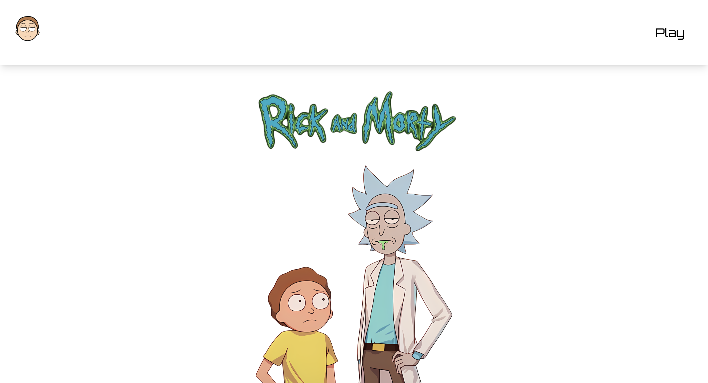
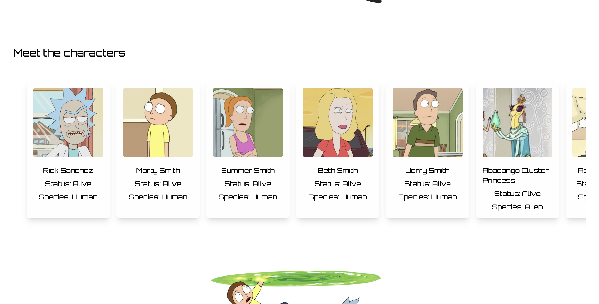
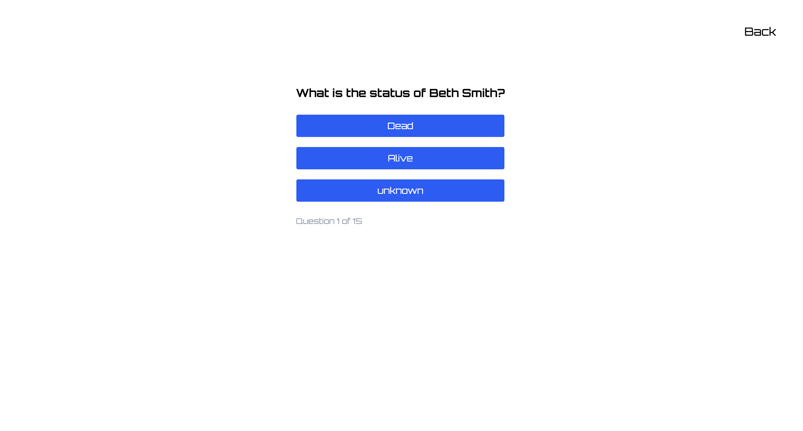

# 🌀 Multiverse Mayhem – A Rick and Morty Trivia Game

Welcome to **Multiverse Mayhem**, a fan-made Rick and Morty trivia game built with **React Router**, **Tailwind CSS**, and the **Rick and Morty API**!

Test your multiversal knowledge across species, origins, and status trivia based on randomly pulled characters from the show. With lazy-loaded components and cached API data, the experience is optimized for both fun and performance.

---

## 🚀 Features

- 🔀 Dynamic questions (Species, Status, Origin)
- 📦 Character data cached with `localStorage`
- ⚡ Lazy loading of heavy components
- 🎮 Smooth quiz experience with score tracking
- 🎨 Fully responsive UI with TailwindCSS

---

## Dashboard View



---

## Characters View



---

## Trivia



---

## 🛠️ Tech Stack

- **React**
- **React Router**
- **Tailwind CSS**
- **Rick and Morty API** – [https://rickandmortyapi.com](https://rickandmortyapi.com)

---

## 🧠 Trivia Logic

Trivia questions are generated dynamically using character data:

- `"What species is Rick?"`
- `"Where is Morty originally from?"`
- `"What is the status of Birdperson?"`

Questions and answers are randomized, and user selections are scored in real time.

---

## 🧪 Run Locally

```bash
git clonehttps://github.com/Mayowa-Dimeji/rick-morty-ts.git
cd rick-and-morty
npm install
npm run dev
```

---

---

## 🙌 Credits

Inspired by **Rick and Morty** (Adult Swim)  
Powered by the awesome [Rick and Morty API](https://rickandmortyapi.com)

---

## 📜 License

This project is fan-made and for educational purposes only. Not affiliated with Adult Swim or Rick and Morty creators.
